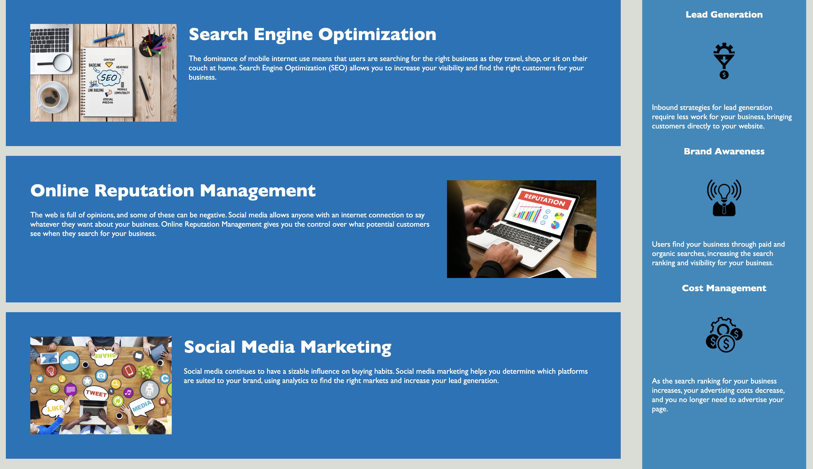

# Challenge-1-Horiseo


## Description

Provide a short description explaining the what, why, and how of your project. Use the following questions as a guide:

- What was your motivation?

My motivation was to make changes to the code which would not affect the layout of the page. I did this to practice adding semantic elements to my html code. 

- Why did you build this project? 

I built this project in order to practice coding in html that was accessible and would increase seo. 

- What problem does it solve?

It solves the problem of having an html file that is not accessible and makes it accessible. Since nonaccessible pages 
can be subject to law suits. 

- What did you learn?

I learned that by adding semantic elements I can improve a file without changing the layout of a page. 

## Usage

Navigate to the link provided at the bottom of this page to see the following Webpage 

md

Provide instructions and examples for use. Include screenshots as needed.

    ```md
    
    ```
    ```md
    
    ```  
    

## Credits

The original code came from [alt text](assets/index.html)

I got help from the Tutor Chris Baird
git

## Test

use the following link to see the launched page 

https://alejandraquintero018.github.io/Challenge-1-Horiseo/

